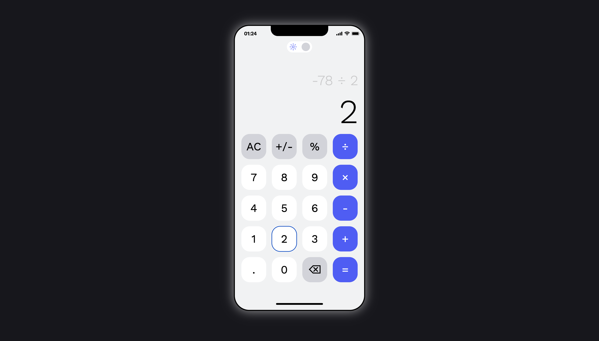
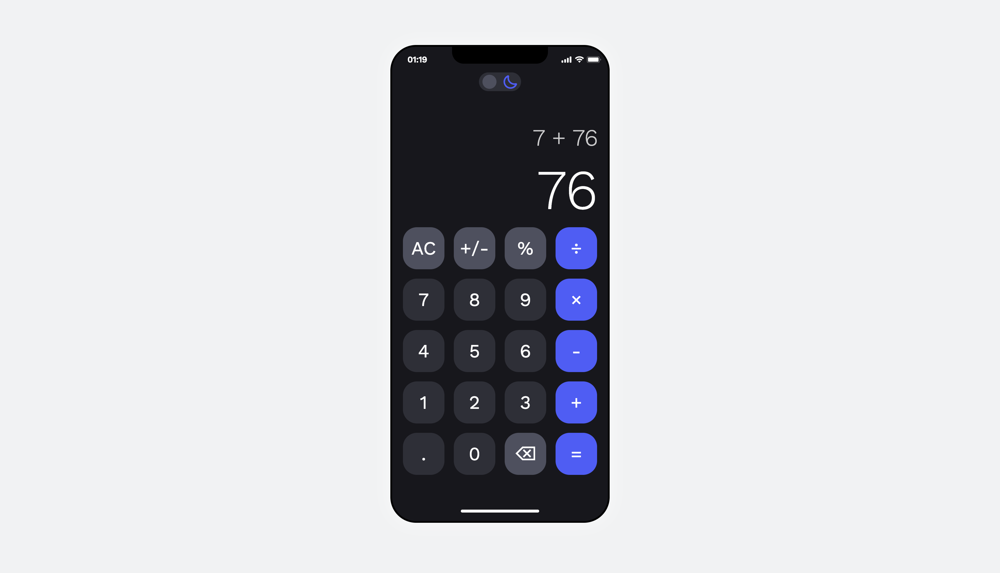

# 📱 Calculator App

 
 


iOS-style калькулятор, сделанный как pet-проект.  
Реализованы базовые операции, работа с отрицательными числами, поддержка десятичных значений, кнопка Backspace и переключение тёмной/светлой темы.  

###👉 **Демо:** [Открыть калькулятор](https://sergiomartinov31.github.io/Calculator-App/)

### Верстка с figma: 👉 [Открыть макет](https://www.figma.com/design/hFbyS1oBKzkyDTo3GFl59A/Responsive-Calculator-App--Community-?node-id=16-678&t=lMxLDPjDAV1J9F5k-0)

---

## ✨ Функционал
- Базовые операции: `+`, `-`, `×`, `÷`
- Поддержка десятичных чисел (`.`)
- Кнопка `±` (смена знака)
- Кнопка `⌫` (удаление последнего символа)
- Кнопка `AC` (сброс)
- Реалтайм часы в шапке
- Переключение тёмной/светлой темы (сохраняется в `localStorage`)
- Анимации на кнопках и плавные переходы

---

## 🛠 Технологии
- **HTML5** (семантическая разметка + aria-атрибуты)
- **SCSS (BEM)** — структурированная стилизация
- **JavaScript (ES6+)** — логика калькулятора и переключение тем
- **Vite** — сборка проекта
- **GitHub Pages** — деплой

---

## 📦 Установка и запуск
1. Клонировать репозиторий:
   ```bash
   git clone https://github.com/SergioMartinov31/Calculator-App.git
   cd Calculator-App
   ```
2. Установить зависимости:
   ```bash
   npm install
   ```
3. Запустить проект:
    ```bash
    npm run dev
    ```

## 🌍 Деплой
Проект доступен по адресу:
👉 https://sergiomartinov31.github.io/Calculator-App/

## 📷 Скриншоты  

| ☀️ Светлая тема | 🌙 Тёмная тема |
|-----------------|----------------|
|  |  |


## 🤝 Контакты
Автор: Sergio Martinov
telegram: @sergio0_1


